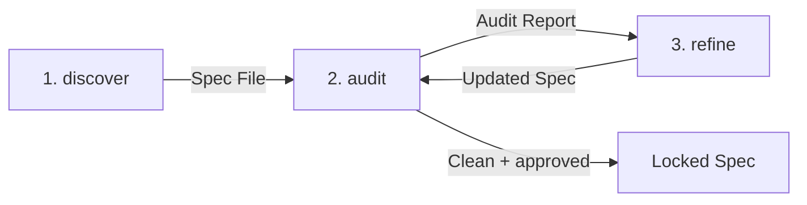
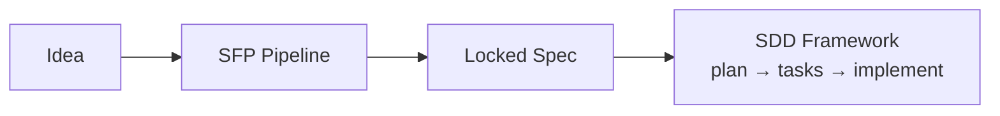

# Spec-First Protocol (SFP)

> An informal precursor to Specification-Driven Development

Every execution framework (whether it drives code generation, documentation, policy design, or system architecture)
assumes a set of requirements as input. None of them define how that specification gets created. SFP fills that gap. It
is the structured, auditable process that transforms a vague idea into a locked specification _before_ any downstream
framework begins execution.

SFP shifts the cognitive load of formal specification writing from the project owner to an automated, iterative pipeline
of specialized skills. Through a structured discovery interview, adversarial audit, and incremental refinement loop, it
produces specifications that are complete, internally consistent, and free of placeholders—ready for any SDD execution
agent to consume.

SFP is **domain-agnostic**. It works for any domain where a structured specification precedes execution: software
engineering, program management, technical writing, policy design, system architecture, and documentation.

---

## Why This Protocol Exists

### The Cost of Skipping the Spec

Starting execution without a specification is the most expensive shortcut in any project.

- **Scope creep is invisible.** Requirements expand silently through conversation, with no single document to compare
  against.
- **Rework compounds.** Ambiguities discovered during execution force stop-and-ask cycles that fragment progress.
- **Deliverables drift from intent.** When the "spec" lives in a thread of chat messages, the executor fills gaps with
  assumptions. The result satisfies _an_ interpretation of the request, but not necessarily _the_ one.
- **AI workflows are especially vulnerable.** LLMs operate within finite context windows. Without a compressed,
  structured source of truth, execution agents inherit every ambiguity from every prior message, amplifying context
  drift and hallucination risk with every turn.

A specification is not bureaucracy. It is the cheapest possible way to discover disagreements, surface edge cases, and
align expectations _before_ execution begins.

### Why a Blank Page Is Not Enough

Writing a specification is valuable, but sitting in front of a blank document and forcing yourself to anticipate every
requirement, edge case, and constraint is a different skill from understanding what you want. SFP separates these
concerns:

| Capability                             | What SFP Provides                                                                                                                                                                                       |
| :------------------------------------- | :------------------------------------------------------------------------------------------------------------------------------------------------------------------------------------------------------ |
| **Structured extraction**              | The discover skill asks the right questions in the right order, systematically surfacing requirements that a blank page would leave buried.                                                             |
| **Adversarial verification**           | The audit skill reviews the compiled specification for contradictions, gaps, and undefined behavior, catching issues that the author's own blind spots would miss.                                      |
| **Zero Placeholder Guarantee**         | Every section is either fully populated from validated requirements or omitted entirely. No stubs, TODOs, or "TBD" sections survive the pipeline.                                                       |
| **Domain-agnostic adaptability**       | The same protocol works whether specifying a software system, a documentation structure, a business process, or a policy. Skills adapt their language and structure to the domain as context emerges.   |
| **Separation of design and execution** | The specification is locked before any execution begins, establishing a clear boundary between deciding _what_ to build and _building_ it.                                                              |
| **Downstream Guidance**                | Appends an actionable, synthesized Downstream Execution Prompt directly to the locked specification, giving downstream AI agents and tools a clear roadmap for execution without manual prompt writing. |

---

## How It Works

### The Discovery Funnel

Traditional AI workflows assume the user starts with a fully formed idea. SFP treats specification extraction as an
interactive, broad-to-specific funnel:



### Pipeline Stages

The protocol implements this funnel using three specialized Agent Skills, culminating in a finalization gate:

| Stage | Skill                        | Input                          | Output                                                       | Description                                                                                                                                                                                                                                                                                                                                                                                                 |
| :---: | :--------------------------- | :----------------------------- | :----------------------------------------------------------- | :---------------------------------------------------------------------------------------------------------------------------------------------------------------------------------------------------------------------------------------------------------------------------------------------------------------------------------------------------------------------------------------------------------- |
| 1     | **Discover**                 | Project owner interview        | Discovery Notes + `.sfp/.../YYYY-MM-DD_<SLUG>_SPEC_DRAFT.md` | Conducts a structured interview to extract requirements, goals, constraints, and edge cases. Produces a **project slug** and **Discovery Notes**. When the scope is clear and the owner approves, compiles the notes into a draft specification file inside the spec-specific `.sfp/` subdirectory.                                                                                                         |
| 2     | **Audit**                    | Draft specification            | Audit Report                                                 | Performs an adversarial review to surface contradictions, gaps, and risks. Generates a severity-classified **Audit Report**.                                                                                                                                                                                                                                                                                |
| 3     | **Refine**                   | Audit Report + owner decisions | Updated specification                                        | Walks through audit findings **one at a time** with the project owner, resolving each incrementally. Offers an opportunity to expand scope after findings are resolved. After all decisions are made, presents a summary for approval and recompiles the specification from updated Discovery Notes.                                                                                                        |
| 4     | **Lock** (Finalization Gate) | Clean audit + owner approval   | `specs/YYYY-MM-DD_<SLUG>_SPEC.md`                            | Once the audit contains no blockers, all requirements from the Discovery Notes are represented, and the project owner explicitly approves, the specification is locked. The `_DRAFT` suffix is removed, the specification is moved to the `specs/` directory, the `.sfp/` working directory is cleaned up, and a non-normative Downstream Execution Prompt is appended if downstream guidance is available. |

### Key Benefits

- **Decoupled Lifecycles** — Establishes a clear structural boundary between design (specifying) and execution
  (building).
- **Zero Placeholder Invariant** — Guarantees all sections of the specification are either fully populated or omitted
  entirely. No stubs, TODOs, or placeholders.
- **Context Drift Mitigation** — Compresses discussions into a structured specification before execution starts,
  preventing token bloat and context drift in downstream execution loops.
- **Domain Agnostic** — Adapts to any domain where structured specifications precede execution: software, documentation,
  business processes, or policy design.

---

## SFP in the SDD Ecosystem

SFP operates upstream of Specification-Driven Development (SDD) execution frameworks. It acts as the "specification
creation engine" that produces the locked, validated input that downstream frameworks assume they already have.

### Pipeline Position



SFP's scope ends exactly at the locked specification. Downstream execution, planning, and code generation are handled by
separate tools.

### What SFP Is Not

SFP establishes a hard boundary at design and does **not**:

- **Generate implementation plans** or task breakdowns.
- **Scaffold projects**, manage CI/CD, or deploy code.
- **Execute implementations** or generate source code.
- **Replace execution frameworks**—it produces the input they consume.

### Additive Value

SFP brings unique, additive value to the SDD lifecycle:

- **Shift Cognitive Load**: Extracts hidden requirements through structured, interactive discovery rather than expecting
  upfront user articulation.
- **Enforce Verification**: Mandates a severity-classified adversarial audit gate before final sign-off, catching
  critical gaps that ad-hoc reviews miss.
- **Guarantee Completeness**: Enforces the Zero Placeholder Invariant. Every section is fully written or completely
  omitted—no TODOs or stubs.
- **Optimize Context**: Compresses verbose discovery into a single, high-density specification, reducing token
  consumption and downstream hallucination.
- **Stay Agnostic**: Outputs standard Markdown with no proprietary formatting or CLI dependencies, compatible with any
  downstream tool or agent.
- **Runnable Downstream Guidance**: Synthesizes the active Persona's rules with the specification's deliverables into
  an executable Downstream Execution Prompt appended directly to the locked file, eliminating manual prompt-engineering
  for downstream code-generation loops.

### Traditional Single-Prompt vs. SFP Pipeline

Most execution agents rely on a single-prompt approach, attempting to write the spec all at once. SFP replaces this with
a structured, iterative pipeline.

| Dimension                   | Single-Prompt                     | SFP Pipeline                      |
| :-------------------------- | :-------------------------------- | :-------------------------------- |
| **Requirements Extraction** | Single-prompt reliance            | Structured, interactive interview |
| **Verification**            | Optional, ad-hoc clarification    | Mandatory adversarial audit gate  |
| **Output Guarantees**       | Variable, stubs, and placeholders | Zero placeholder invariant        |
| **Framework Coupling**      | Tied to specific tool or CLI      | 100% agnostic (standard Markdown) |
| **Lifecycle Boundary**      | Blurs design and execution        | Hard line at locked specification |

### Why SFP

Most AI development workflows assume you start with a fully formed idea or expect the development agent to gather
requirements and write code in the same verbose context window. SFP decouples requirements planning from code
execution:

| Dimension                    | Raw Prompting              | Standard SDD Tools       | Spec-First Protocol (SFP)                                  |
| :--------------------------- | :------------------------- | :----------------------- | :--------------------------------------------------------- |
| **Requirements Gathering**   | Single-prompt, ad-hoc      | Automated templates      | **Structured Discovery Funnel**                            |
| **Verification Gate**        | None (Immediate code-gen)  | Self-verification (Bias) | **Adversarial Audit Gate**                                 |
| **Output Quality**           | Stubs, placeholders, TODOs | Variable placeholders    | **Zero Placeholder Invariant** (Strict)                    |
| **Handoff Token Efficiency** | Verbose chat histories     | Large context overhead   | **Attention Dilution Prevention (~85% context reduction)** |
| **Handoff Usability**        | Manual prompt crafting     | Static file handoff      | **Runnable Downstream Guidance**                           |

---

## Running the Protocol

SFP supports two execution modes. The protocol flow is the same regardless of which mode you choose.

### Multi-Context Mode (Core Flow)

Invoke each skill individually, clearing context between phases. This is the recommended approach for large
specifications or constrained context windows.

1. **Initialize** — Invoke the **Spec Discover** skill to start a new specification. This creates the `.sfp/` working
   directory and a spec-specific subdirectory, then begins the structured interview. When the scope is clear, discover
   compiles the specification with your approval, producing a `YYYY-MM-DD_<SLUG>_SPEC_DRAFT.md` file inside the
   `.sfp/` subdirectory.
2. **Audit** — Clear your context, then invoke the **Spec Audit** skill to review the draft specification for
   contradictions, gaps, and risks. The audit produces a full report.
3. **Refine** — If issues are found, clear your context and invoke the **Spec Refine** skill. It walks through each
   finding one at a time, records your decisions, offers a chance to expand scope, and recompiles the specification with
   your approval.
4. **Iterate** — Continue the audit → refine cycle (clearing context between each) until the specification is clean and
   approved.
5. **Finalize** — When the audit passes and you approve, the specification is locked, the `_DRAFT` suffix is removed,
   the file is moved to the `specs/` directory, and the `.sfp/` subdirectory is cleaned up.

### Single-Context Mode

Invoke the **Spec Orchestrate** skill to run the full pipeline in one continuous conversation. The orchestrator
delegates to each individual skill automatically, without context clearing between phases.

This mode is best when your model's context window is large enough to hold the entire conversation across discovery,
audit, and refinement. For very large specifications or constrained context windows, use the multi-context mode above
instead.

### Directory Structure

SFP is implemented as [Agent Skills](https://github.com/anthropics/agent-skills), lightweight open formats for extending
AI agent capabilities.

```text
skills/
├── sfp-orchestrate/
│   └── SKILL.md            # Full pipeline orchestrator (single-context)
├── sfp-discover/
│   └── SKILL.md            # Structured interview + specification compiler
├── sfp-audit/
│   └── SKILL.md            # Adversarial review + finalization gate
├── sfp-refine/
│   └── SKILL.md            # Incremental finding resolution + recompiler
└── sfp-personas/
    └── SKILL.md            # Interactive persona builder & configurations
```

At runtime, the protocol creates a `.sfp/` working directory in the project root with per-specification subdirectories:

```text
.sfp/                                   # Created by discover
└── YYYY-MM-DD_<SLUG>/                  # One subdirectory per spec
    ├── discovery_notes.md              # Running requirements summary
    ├── audit_report.md                 # Findings from the most recent audit
    ├── YYYY-MM-DD_<SLUG>_SPEC_DRAFT.md # Active draft specification
    └── status.md                       # Pipeline iteration state
```

Active specification drafts are stored inside their spec-specific `.sfp/YYYY-MM-DD_<SLUG>/` subdirectory. When
finalized and locked, the `_DRAFT` suffix is removed, the `.sfp/YYYY-MM-DD_<SLUG>/` directory is archived/deleted,
and the locked specification file is moved to the visible `specs/` directory in the project root:

```text
specs/
└── YYYY-MM-DD_<SLUG>_SPEC.md           # Locked specification
```

---

## Installation

Install the protocol's skills using the CLI runner or manually download and extract the pre-packaged release zip file.

### CLI Installation (Recommended)

Run the following command in your local project root or global config directory. This requires
[Node.js](https://nodejs.org/) (which includes `npx`). If you do not have Node.js installed,
please use the [Manual Installation Fallback](#manual-installation-fallback) instead.

```bash
npx skills add awhipp/spec-first-protocol --skill '*'
```

#### Supported AI Agent Slugs

By default, the CLI auto-detects all supported agents. You can target a specific AI agent
integration using the `--agent` parameter:

```bash
npx skills add awhipp/spec-first-protocol --skill '*' --agent claude-code
```

#### Advanced Flags

The runner supports several flags:

- `-g`, `--global` — Installs the skills globally in the user's home folder rather than local project directories.
- `-p`, `--project` — Installs the skills in the current project directory (local scope) instead of global user folders.
- `-y`, `--yes` — Bypasses all confirmation prompts (ideal for non-interactive/CI environments).

Example with combined options:

```bash
npx skills add awhipp/spec-first-protocol --skill '*' --agent cursor --global --yes
```

### Manual Installation Fallback

If you do not want to use Node.js/`npx`, download the release archive directly:

1. Download the pre-packaged `skills.zip` archive from the latest GitHub Release:
   [skills.zip](https://github.com/awhipp/spec-first-protocol/releases/latest/download/skills.zip)
   _(If the direct download fails, browse release assets at the backup_
   _[GitHub Releases](https://github.com/awhipp/spec-first-protocol/releases) page)._
2. Extract the zip file locally.
3. Copy the nested `skills/` directories (`sfp-discover`, `sfp-audit`, `sfp-refine`, `sfp-orchestrate`,
   `sfp-personas`) directly into your target agent config directory:

| Agent / Editor  | Target Directory    |
| :-------------- | :------------------ |
| **Claude Code** | `.claude/skills/`   |
| **Antigravity** | `.agents/skills/`   |
| **Windsurf**    | `.windsurf/skills/` |
| **Cursor**      | `.cursor/skills/`   |

---

## Example Walkthrough

To see SFP in action, review the locked specification generated for this repository's skill distribution utility:
**[Skill Distribution Spec](examples/2026-06-01_SKILL-DISTRIBUTION_SPEC.md)**

We started with very vague requirements:

> "I need a way to distribute and install these agentic skills with one click."

After 3 cycles through the interactive `discover` → `audit` → `refine` loop, we refined the design, resolved ambiguities
around target directory mappings, parameter definitions, and failure modes, and generated a cohesive, production-ready
implementation spec.

When passed to another agent to implement, the resulting planning outcome was fully implemented in one shot. This
produced:

- CLI integration via Vercel Labs skills runner and dynamic onboarding tools
- A release workflow (`.github/workflows/release-skills.yml`)

### Domain Expertise & Personas

SFP is fundamentally **domain-agnostic**. To enforce specific domain rules without coupling the core
skills, SFP supports **Personas**.

When SFP starts, the interactive triage dynamically detects the project scope and recommends a Persona configuration
(loaded from `.sfp/personas/` in the project, `~/.sfp/personas/` in the user's home directory, or the pre-packaged
`skills/sfp-personas/` fallback). Once selected, SFP adopts the persona's tone, injecting specialized discovery
prompts, custom templates, and strict auditing rules (e.g., verifying a budget constraint for travel, or max
drawdown for stocks).

| Persona                  | Domain             | Specialization                                       |
| :----------------------- | :----------------- | :--------------------------------------------------- |
| **Curriculum Designer**  | Education          | Learning objectives, assessments, accessibility.     |
| **Event Planner**        | Event Coordination | Vendor coordination, run-of-show, venue capacity.    |
| **Fitness Coach**        | Health & Fitness   | Biometrics, macros, progressive overload.            |
| **RPG Campaign Master**  | Tabletop RPGs      | Narrative arcs, NPC hooks, milestone leveling.       |
| **Stock Market Advisor** | Stock Trading      | Risk tolerance, asset allocation, sector exclusions. |
| **Travel Advisor**       | Travel Planning    | Logistics, strict budgets, daily itineraries.        |

You can use the **Spec Personas** skill (`skills/sfp-personas/SKILL.md`) to interactively create your own custom
personas or refine existing ones without manually writing the configuration files.

To see how SFP acts as a Travel Advisor, review the locked specification for planning a family
vacation to Walt Disney World, output directly by the Travel Advisor persona:
**[Disney Vacation Spec](examples/non-software/2026-06-02_PERFECT-DISNEY-VACATION_SPEC.md)**

---

## Skill Authoring Standards

All skills in this repository adhere to the following constraints to ensure reliable agent processing across platforms:

| Constraint                       | Limit                        | Rationale                                                               |
| :------------------------------- | :--------------------------- | :---------------------------------------------------------------------- |
| `SKILL.md` length                | ≤ 500 lines (~5,000 tokens)  | Ensures the agent processes core instructions within context limits     |
| Description (YAML `description`) | ≤ 200 characters             | Maximum length for reliable skill routing across agents (e.g., Claude)  |
| Reference document length        | ≤ 300 lines (~6 KB) per file | Keeps supplementary material absorbable; include a TOC for longer files |

Contributors should verify these constraints before submitting changes.

---

## Terminology

| Term                            | Definition                                                                                                                                                                                                                                      |
| :------------------------------ | :---------------------------------------------------------------------------------------------------------------------------------------------------------------------------------------------------------------------------------------------- |
| **Discovery Notes**             | A running, cumulative summary of locked requirements and open questions, organized by topic. Stored at `.sfp/YYYY-MM-DD_<SLUG>/discovery_notes.md`.                                                                                             |
| **Specification File**          | The compiled specification document, named `YYYY-MM-DD_<SLUG>_SPEC_DRAFT.md` while in progress (stored in `.sfp/YYYY-MM-DD_<SLUG>/`) and `YYYY-MM-DD_<SLUG>_SPEC.md` when finalized (moved to `specs/`).                                        |
| **Audit Report**                | A structured report listing findings classified by severity (Blocker, Warning, Suggestion) and the overall gate status. Stored at `.sfp/YYYY-MM-DD_<SLUG>/audit_report.md`.                                                                     |
| **Project Slug**                | An uppercase, hyphen-separated identifier derived from the project name (e.g., `TASK-MANAGEMENT`), used in the specification filename and `.sfp/` subdirectory name.                                                                            |
| **`.sfp/` Directory**           | A working directory in the project root containing per-specification subdirectories (`.sfp/YYYY-MM-DD_<SLUG>/`). Each subdirectory holds Discovery Notes and Audit Reports for one specification. Cleaned up when specifications are finalized. |
| **DRAFT Status**                | The `_DRAFT` suffix in the specification filename indicating the spec is in progress. Removed by the audit skill when the specification is finalized and locked.                                                                                |
| **Zero Placeholder Invariant**  | The requirement that all specification sections must be fully written or omitted entirely. No placeholder text, TODOs, or stubs are permitted.                                                                                                  |
| **Finalization Gate**           | The checkpoint where the project owner signs off on the audited specification. Requires zero blockers, representation of all requirements from Discovery Notes, and explicit approval.                                                          |
| **Contradiction Blocker**       | The guardrail that halts the pipeline immediately if a project owner's input contradicts a previously locked requirement.                                                                                                                       |
| **Scope Creep Containment**     | The practice of identifying and flagging requirements that fall outside defined system boundaries for triaging.                                                                                                                                 |
| **Zero Solution Design**        | The constraint prohibiting the auditor from designing fixes or proposing implementations; they must only identify what is broken and why.                                                                                                       |
| **No Silent Passes**            | The requirement that the audit report must explicitly state if the specification is consistent and ready for sign-off, rather than being empty.                                                                                                 |
| **Context Preservation**        | The rule that the compiler must not alter already locked specification sections unless incoming inputs explicitly override them.                                                                                                                |
| **Structural Invariance**       | The requirement that the compiler must always output the complete, updated specification, rather than partial snippets or diffs.                                                                                                                |
| **Compilation Gate**            | The confirmation checkpoint where the project owner approves a summary of requirements or decisions before the specification file is written or rewritten.                                                                                      |
| **Downstream Execution Prompt** | A non-normative, synthesized Markdown block appended to the locked specification file. It instructs downstream execution agents (like Cursor, Windsurf, or Claude Code) on how to generate the spec deliverables.                               |
| **Downstream Guidance**         | Domain-specific instructions defined in a Persona configuration that specify how downstream execution agents should implement the locked specification.                                                                                         |

---

## License

This project is licensed under the MIT [License](LICENSE).
