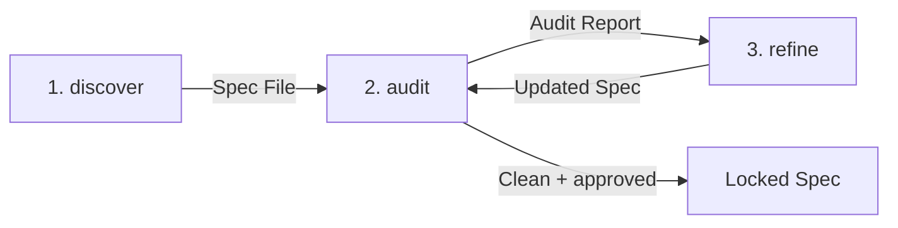

# Spec-First Protocol (SFP) for Specification-Driven Development (SDD)

A protocol for transforming vague ideas into rigorous, structured
specifications through an interactive discovery pipeline before execution
begins.

The Spec-First Protocol (SFP) is a formal precursor to Specification-Driven
Development (SDD). While SDD focuses on how an execution agent consumes a
finalized specification to produce deliverables, SFP governs the phase before
the specification is locked. It shifts the cognitive load of formal
specification writing from the project owner to an automated, iterative
pipeline of specialized skills.

SFP is domain-agnostic. It works for any domain where a structured
specification precedes execution, including program management, technical
writing, policy design, system architecture, and documentation.

## Why Specifications Matter

### The Cost of Skipping the Spec

Starting execution without a specification is the most expensive shortcut in
any project. Without a spec:

- **Scope creep is invisible** and requirements expand silently through
  conversation, with no single document to compare against.
- **Rework compounds** and ambiguities discovered during execution force
  stop-and-ask cycles that fragment progress.
- **Deliverables drift from intent** when the "spec" lives in a thread of
  chat messages, the executor fills gaps with assumptions. The result is an
  artifact that satisfies *an* interpretation of the request, but not
  necessarily *the* one.
- **AI workflows are especially vulnerable** as LLMs operate
  within finite context windows. Without a compressed, structured source of
  truth, execution agents inherit every ambiguity from every prior message,
  amplifying context drift and hallucination risk with every turn.

A specification is not bureaucracy. It is the cheapest possible way to
discover disagreements, surface edge cases, and align expectations *before*
execution begins.

### What SFP Adds Beyond a Blank Page

Writing a specification is valuable. But sitting in front of a blank document
and forcing yourself to anticipate every requirement, edge case, and
constraint is a different skill from understanding what you want. SFP
separates these concerns:

- **Structured extraction through interview.** The discover skill asks the
  right questions in the right order, systematically surfacing requirements
  that a blank page would leave buried.
- **Adversarial verification.** The audit skill reviews the compiled
  specification for contradictions, gaps, and undefined behavior, catching
  issues that the author's own blind spots would miss.
- **Zero Placeholder Guarantee.** Every section of the specification is
  either fully populated from validated requirements or omitted entirely.
  No stubs, TODOs, or "TBD" sections survive the pipeline.
- **Domain-agnostic adaptability.** The same protocol works whether you are
  specifying a software system, a documentation structure, a business
  process, or a policy. The skills adapt their language and structure to the
  domain as context emerges.
- **Separation of design and execution.** The specification is locked before
  any execution begins, establishing a clear boundary between deciding *what*
  to build and *building* it.

## How It Works

### The Discovery Funnel

Traditional AI workflows assume the user starts with a fully formed idea.
SFP instead treats specification extraction as an interactive,
broad-to-specific funnel:



The protocol implements this funnel using three specialized Agent Skills,
culminating in a finalization gate:

1. **Discover** (`skills/discover/`): Conducts a structured interview to
   extract requirements, goals, constraints, and edge cases, producing
   **Discovery Notes** and a **project slug**. When the scope is clear and the
   owner approves, compiles the notes into a draft specification file
   (`YYYY-MM-DD_<SLUG>_SPEC_DRAFT.md`).
2. **Audit** (`skills/audit/`): Performs an adversarial review of the
   specification to surface contradictions, gaps, and risks, generating a
   severity-classified **Audit Report**.
3. **Refine** (`skills/refine/`): Walks through audit findings **one at a
   time** with the project owner, resolving each incrementally. Offers an
   opportunity to expand scope after findings are resolved. After all
   decisions are made, presents a summary for approval and recompiles the
   specification from updated Discovery Notes.
4. **Lock** (Finalization Gate): Once the audit contains no blockers, all
   requirements from the Discovery Notes are represented, and the project
   owner explicitly approves, the specification is locked. The `_DRAFT`
   suffix is removed from the filename, the `.sfp/` working directory is
   cleaned up, and the locked specification file remains in the project root.

### Key Benefits

- **Decoupled Lifecycles**: Establishes a clear structural boundary between
  design (specifying) and execution (building).
- **Zero Placeholder Invariant**: Guarantees all sections of the specification
  are either fully populated or omitted entirely—no stubs, TODOs, or
  placeholders.
- **Context Drift Mitigation**: Compresses discussions into a structured
  specification before execution starts, preventing token bloat and context
  drift in downstream execution loops.
- **Domain Agnostic**: Adapts to any domain where structured specifications
  precede execution, such as software, documentation, business processes, or
  policy design.

## How to Use

SFP is implemented as three [Agent Skills][agent-skills], which are
lightweight, open formats for extending AI agent capabilities.

### Directory Structure

```text
skills/
├── discover/
│   ├── SKILL.md            # Structured interview + specification compiler
│   └── references/
│       └── spec-schema.md  # Generic specification skeleton
├── audit/
│   ├── SKILL.md            # Adversarial review + finalization gate
│   └── references/
│       └── audit-report-format.md
└── refine/
    ├── SKILL.md            # Incremental finding resolution + recompiler
    └── references/
        └── spec-schema.md  # Generic specification skeleton
```

At runtime, the protocol creates a `.sfp/` working directory in the project
root with per-specification subdirectories:

```text
.sfp/                                   # Created by discover
└── YYYY-MM-DD_<SLUG>/                  # One subdirectory per spec
    ├── discovery_notes.md              # Running requirements summary
    └── audit_report.md                 # Findings from the most recent audit
```

Draft specifications are written to the project root using the
`YYYY-MM-DD_<SLUG>_SPEC_DRAFT.md` naming convention. The `_DRAFT` suffix is
removed when the specification is finalized and locked.

### Running the Protocol

1. **Initialize**: Invoke the **discover** skill to start a new specification.
   This creates the `.sfp/` working directory and a spec-specific
   subdirectory, then begins the structured interview. When the scope is
   clear, discover compiles the specification with your approval, producing
   a `_SPEC_DRAFT.md` file.
2. **Audit**: Invoke the **audit** skill to review the draft specification
   for contradictions, gaps, and risks. The audit produces a full report.
3. **Refine**: If issues are found, invoke the **refine** skill. It walks
   through each finding one at a time, records your decisions, offers a
   chance to expand scope, and recompiles the specification with your
   approval.
4. **Iterate**: Continue the audit-refine cycle until the specification is
   clean and approved.
5. **Finalize**: When the audit passes and you approve, the specification is
   locked, the `_DRAFT` suffix is removed from the filename, and the
   `.sfp/` subdirectory is cleaned up.

Each skill suggests clearing your context and starting a fresh session when
transitioning to the next skill. This helps prevent context drift between
phases of the protocol.

## Installation

You can install the protocol's skills automatically using our one-line
bootstrap commands, or manually copy/symlink them.

### Automated Installation

Run the appropriate command in your terminal from your local project root.

#### macOS/Linux (Bash)

- **Default (Local directory)**:

  ```bash
  curl -fsSL https://raw.githubusercontent.com/awhipp/spec-first-protocol/main/scripts/install.sh | bash
  ```

- **With Arguments** (e.g., install Claude skills globally):

  ```bash
  curl -fsSL https://raw.githubusercontent.com/awhipp/spec-first-protocol/main/scripts/install.sh | bash -s -- -i claude -s global
  ```

#### Windows (PowerShell)

- **Default (Local directory)**:

  ```powershell
  powershell -ExecutionPolicy Bypass -Command "irm https://raw.githubusercontent.com/awhipp/spec-first-protocol/main/scripts/install.ps1 | iex"
  ```

- **With Arguments** (e.g., install Claude skills globally):

  ```powershell
  powershell -ExecutionPolicy Bypass -Command "& { [scriptblock]::Create((irm https://raw.githubusercontent.com/awhipp/spec-first-protocol/main/scripts/install.ps1)) -i claude -s global }"
  ```

### Manual Installation

Alternatively, manually copy or symlink the `skills/` directory into your
framework's skills directory:

| Agent / Editor | Target Directory | Command |
| :--- | :--- | :--- |
| **Claude** | `.claude/skills/` | `cp -r skills/ .claude/skills/` |
| **Antigravity** | `.agents/skills/` | `cp -r skills/ .agents/skills/skills/` |
| **Windsurf** | `.windsurf/skills/` | `cp -r skills/ .windsurf/skills/` |
| **Cursor** | `.cursor/skills/` | `cp -r skills/ .cursor/skills/` |

## Example Walkthrough

To see SFP in action, review the locked specification generated for this
repository's skill distribution utility:
**[Skill Distribution Spec](examples/2026-06-01_SKILL-DISTRIBUTION_SPEC.md)**

We started with very vague requirements:
> "I need a way to distribute and install these agentic skills with one click."

After 3 cycles through the interactive `discover` -> `audit` -> `refine` loop,
we refined the design, resolved ambiguities around target directory mappings,
parameter definitions, and failure modes, and generated a cohesive,
production-ready implementation spec.

When passed to another agent to implement, the resulting planning outcome was
fully implemented in one shot. This produced:

- Robust, dependency-minimal installer scripts
(i.e. `scripts/install.sh` and `scripts/install.ps1`)
- A release workflow (i.e. `.github/workflows/release-skills.yml`)

## Skill Authoring Standards

All skills in this repository adhere to the following constraints to ensure
reliable agent processing across platforms:

| Constraint | Limit | Rationale |
| :--- | :--- | :--- |
| `SKILL.md` length | ≤ 500 lines (~5,000 tokens) | Ensures the agent processes core instructions within context limits |
| Description (YAML `description`) | ≤ 200 characters | Maximum length for reliable skill routing across agents (e.g., Claude) |
| Reference document length | ≤ 300 lines (~6 KB) per file | Keeps supplementary material absorbable; include a TOC for longer files |

Contributors should verify these constraints before submitting changes.

## Terminology

| Term | Definition |
| :--- | :--- |
| **Discovery Notes** | A running, cumulative summary of locked requirements and open questions, organized by topic. Stored at `.sfp/YYYY-MM-DD_<SLUG>/discovery_notes.md`. |
| **Specification File** | The compiled specification document, named `YYYY-MM-DD_<SLUG>_SPEC_DRAFT.md` while in progress and `YYYY-MM-DD_<SLUG>_SPEC.md` when finalized. Written to the project root. |
| **Audit Report** | A structured report listing findings classified by severity (Blocker, Warning, Suggestion) and the overall gate status. Stored at `.sfp/YYYY-MM-DD_<SLUG>/audit_report.md`. |
| **Project Slug** | An uppercase, hyphen-separated identifier derived from the project name (e.g., `TASK-MANAGEMENT`), used in the specification filename and `.sfp/` subdirectory name. |
| **`.sfp/` Directory** | A working directory in the project root containing per-specification subdirectories (`.sfp/YYYY-MM-DD_<SLUG>/`). Each subdirectory holds Discovery Notes and Audit Reports for one specification. Cleaned up when specifications are finalized. |
| **DRAFT Status** | The `_DRAFT` suffix in the specification filename indicating the spec is in progress. Removed by the audit skill when the specification is finalized and locked. |
| **Zero Placeholder Invariant** | The requirement that all specification sections must be fully written or omitted entirely. No placeholder text, TODOs, or stubs are permitted. |
| **Finalization Gate** | The checkpoint where the project owner signs off on the audited specification. Requires zero blockers, representation of all requirements from Discovery Notes, and explicit approval. |
| **Contradiction Blocker** | The guardrail that halts the pipeline immediately if a project owner's input contradicts a previously locked requirement. |
| **Scope Creep Containment** | The practice of identifying and flagging requirements that fall outside defined system boundaries for triaging. |
| **Zero Solution Design** | The constraint prohibiting the auditor from designing fixes or proposing implementations; they must only identify what is broken and why. |
| **No Silent Passes** | The requirement that the audit report must explicitly state if the specification is consistent and ready for sign-off, rather than being empty. |
| **Context Preservation** | The rule that the compiler must not alter already locked specification sections unless incoming inputs explicitly override them. |
| **Structural Invariance** | The requirement that the compiler must always output the complete, updated specification, rather than partial snippets or diffs. |
| **Compilation Gate** | The confirmation checkpoint where the project owner approves a summary of requirements or decisions before the specification file is written or rewritten. |

## License

This project is licensed under the MIT [License].

[agent-skills]: https://github.com/anthropics/agent-skills
[License]: LICENSE
