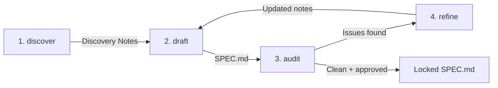

# Spec-First Protocol (SFP) for Specification-Driven Development (SDD)

A protocol for transforming vague ideas into rigorous, structured
specifications through an interactive discovery pipeline before execution
begins.

The Spec-First Protocol (SFP) is a formal precursor to Specification-Driven
Development (SDD). While SDD focuses on how an execution agent consumes a
finalized specification to produce deliverables, SFP governs the phase before
the specification is locked. It shifts the cognitive load of formal
specification writing from the project owner to an automated, iterative
pipeline of specialized skills.

SFP is domain-agnostic. It works for any domain where a structured
specification precedes execution, including program management, technical
writing, policy design, system architecture, and documentation.

## How It Works

### The Discovery Funnel

Traditional AI workflows assume the user starts with a fully formed idea.
SFP instead treats specification extraction as an interactive,
broad-to-specific funnel:



The protocol implements this funnel using four specialized Agent Skills,
culminating in a finalization gate:

1. **Discover** (`skills/discover/`): Conducts a structured interview to
   extract requirements, goals, constraints, and edge cases, producing
   **Discovery Notes**.
2. **Draft** (`skills/draft/`): Compiles the Discovery Notes into a structured
   `SPEC.md` without placeholders, stubs, or invented details.
3. **Audit** (`skills/audit/`): Performs an adversarial review of the draft
   specification to surface contradictions, gaps, and risks, generating a
   severity-classified report.
4. **Refine** (`skills/refine/`): Focuses on resolving specific audit findings
   (blockers and warnings), updating the Discovery Notes for recompilation.
5. **Lock** (Finalization Gate): Once the audit contains no blockers, all
   requirements from the Discovery Notes are represented, and the project
   owner explicitly approves, the specification is locked and becomes
   immutable.

### Key Benefits

- **Decoupled Lifecycles**: Establishes a clear structural boundary between
  design (specifying) and execution (building).
- **Zero Placeholder Invariant**: Guarantees all sections of the specification
  are either fully populated or omitted entirely—no stubs, TODOs, or
  placeholders.
- **Context Drift Mitigation**: Compresses discussions into a structured
  specification before execution starts, preventing token bloat and context
  drift in downstream execution loops.
- **Domain Agnostic**: Adapts to any domain where structured specifications
  precede execution, such as software, documentation, business processes, or
  policy design.

## How to Use

SFP is implemented as four [Agent Skills][agent-skills], which are lightweight,
open formats for extending AI agent capabilities.

### Directory Structure

```text
skills/
├── discover/
│   └── SKILL.md            # Structured interview to extract requirements
├── draft/
│   ├── SKILL.md            # Compile notes into SPEC.md
│   └── references/
│       └── spec-schema.md  # Generic specification skeleton
├── audit/
│   ├── SKILL.md            # Adversarial review + finalization gate
│   └── references/
│       └── audit-report-format.md
└── refine/
    └── SKILL.md            # Targeted iteration on audit findings
```

### Running the Protocol

1. **Initialize**: Invoke the **discover** skill to start a new specification.
2. **Execute the Chain**: Follow the suggested next steps at the end of each
   skill's output (e.g., draft -> audit -> refine).
3. **Iterate**: Continue the cycle until the specification is clean and
   approved.

## Installation

Copy or symlink the `skills/` directory into your framework's skills directory:

| Agent / Editor | Target Directory | Command |
| :--- | :--- | :--- |
| **Claude** | `.claude/skills/` | `cp -r skills/ .claude/skills/` |
| **Antigravity** | `.agents/skills/` | `cp -r skills/ .agents/skills/skills/` |
| **Windsurf** | `.windsurf/skills/` | `cp -r skills/ .windsurf/skills/` |
| **Cursor** | `.cursor/skills/` | `cp -r skills/ .cursor/skills/` |

## Example Walkthrough

A condensed example showing one cycle through the protocol:

1. **Discover**: The project owner requests: "I want to build a task
   management system." The `discover` skill asks about the system type,
   existing context, and expected outcomes. Over several turns, it extracts
   entities (Task, User), a state machine (open -> in-progress -> done),
   assignment rules, and edge cases (e.g., what happens when a user is
   deleted). It then outputs Discovery Notes summarizing locked requirements
   and open questions.
2. **Draft**: The `draft` skill compiles the Discovery Notes into a `SPEC.md`
   containing sections for Overview, Domain Model, Workflows and Processes,
   Interfaces and Contracts, Constraints and Rules, Failure Modes and Edge
   Cases, and Open Questions.
3. **Audit**: The `audit` skill reviews the draft and identifies a blocker
   (undefined behavior when an in-progress task loses its assignee), a warning
   (any user can complete any user's task), and a suggestion (authentication
   mechanism unspecified). It outputs an Audit Report with a gate status of
   "Not Ready".
4. **Refine**: The `refine` skill presents the blocker and warning to the
   project owner, who decides that tasks should revert to "open" when their
   assignee is removed, and state transitions should be restricted to the
   assignee. The `refine` skill updates the Discovery Notes and suggests
   re-drafting.
5. **Finalization**: The `draft` skill recompiles the specification. The
   `audit` skill verifies that there are zero blockers, the project owner
   signs off, and the specification is locked.

## Terminology

| Term | Definition |
| :--- | :--- |
| **Discovery Notes** | A running, cumulative summary of locked requirements and open questions, organized by topic. |
| **SPEC.md** | The compiled specification document that becomes immutable after sign-off. |
| **Audit Report** | A structured report listing findings classified by severity (Blocker, Warning, Suggestion) and the overall gate status. |
| **Zero Placeholder Invariant** | The requirement that all specification sections must be fully written or omitted entirely. No placeholder text, TODOs, or stubs are permitted. |
| **Finalization Gate** | The checkpoint where the project owner signs off on the audited specification. Requires zero blockers, representation of all requirements from Discovery Notes, and explicit approval. |
| **Contradiction Blocker** | The guardrail that halts the pipeline immediately if a project owner's input contradicts a previously locked requirement. |
| **Scope Creep Containment** | The practice of identifying and flagging requirements that fall outside defined system boundaries for triaging. |
| **Zero Solution Design** | The constraint prohibiting the auditor from designing fixes or proposing implementations; they must only identify what is broken and why. |
| **No Silent Passes** | The requirement that the audit report must explicitly state if the specification is consistent and ready for sign-off, rather than being empty. |
| **Context Preservation** | The rule that the compiler must not alter already locked specification sections unless incoming inputs explicitly override them. |
| **Structural Invariance** | The requirement that the compiler must always output the complete, updated SPEC.md, rather than partial snippets or diffs. |

## License

This project is licensed under the MIT [License].

[agent-skills]: https://github.com/anthropics/agent-skills
[License]: LICENSE
