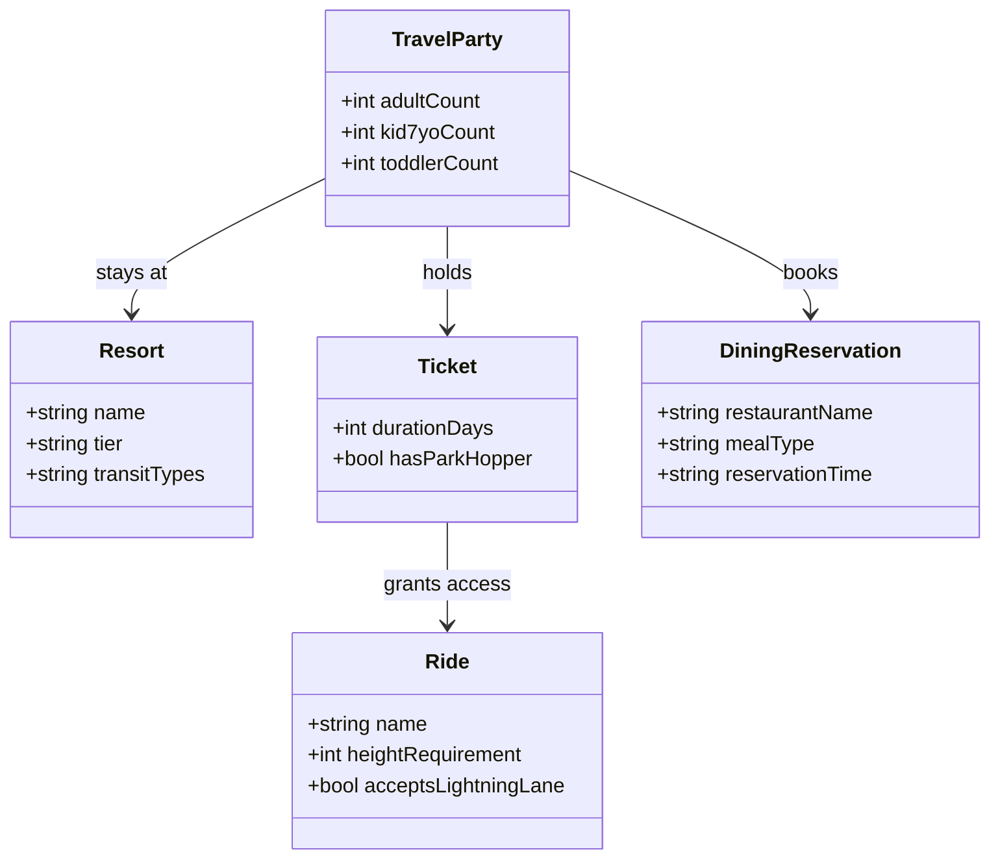
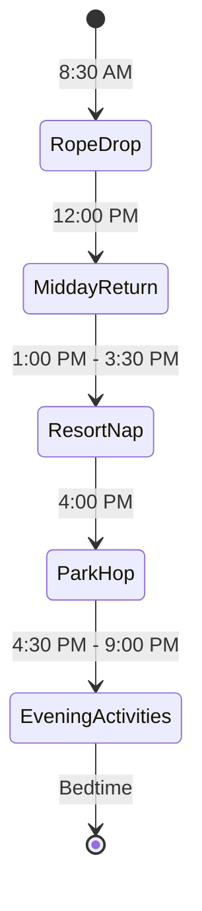

# Perfect Disney Vacation Specification

> **Specification Draft**
> Project Slug: PERFECT-DISNEY-VACATION
> Date: 2026-06-02
> Status: DRAFT (Refinement Cycle 1 Complete)

## 1. Overview

This specification details the plan, logistics, daily schedule, and constraints for a 4-day Disney World vacation for a family of 4. The goal is to provide a stress-free, slow-paced vacation that accommodates the needs of a toddler requiring a midday nap, while still allowing the 7-year-old child and adults to experience Disney's top-rated attractions, character interactions, and highly rated dining options.

### Stakeholders & Travel Party

- **Adults (2)**: Primary planners, supervising the children and managing Lightning Lane booking.

- **Child (7 years old)**: Tall enough to not require a booster seat in rideshares; target height-restricted rides (38" to 40") and moderate thrill attractions.
- **Toddler (2–3 years old)**: Requires a stroller, has a strict midday nap requirement (1:00 PM – 3:30 PM), and is restricted to rides with no height requirement.

---

## 2. Vacation Domain Model

This section defines the key elements, resources, and terminology that form the vacation plan.

### 2.1 Accommodation: Port Orleans Resort - Riverside

- **Tier**: Moderate.

- **Amenities**: Swimming pools, food court, table-service dining, themed rooms, and quiet atmosphere.
- **Transit Options**:
  - Complimentary buses to all four theme parks.
  - Complimentary water taxi (boat) to Disney Springs.

### 2.2 Tickets: 4-Day Park Hopper

- **Properties**: Valid for entry to all 4 theme parks on any day. Allows hopping between parks starting at any time during park hours.

- **Target Parks**: Magic Kingdom, EPCOT, Disney's Hollywood Studios, Disney's Animal Kingdom.

### 2.3 Ride Categories

- **Toddler-Friendly Rides**: No height requirement (e.g., Peter Pan's Flight, Frozen Ever After, Kilimanjaro Safaris).

- **7-Year-Old & Adult Rides**: Minimum height requirements (e.g., Slinky Dog Dash [38"], Big Thunder Mountain Railroad [40"], Toy Story Mania [no limit]).
- **Exclusions**: Star Wars attractions (not of interest yet) and Guardians of the Galaxy: Cosmic Rewind (skipped to prioritize gentler rides).

### 2.4 Lightning Lane System (LL)

- **Lightning Lane Multi Pass**: Purchased daily. Allows booking return times for multiple attractions to bypass regular standby queues.

- **Lightning Lane Single Pass**: Purchased individually for top headliners not included in Multi Pass (not prioritized for this trip).
- **Tiering Constraint (EPCOT/Hollywood Studios)**: Pre-booking allows only **one** Tier 1 attraction per day. Subsequent Tier 1 choices can only be made after scanning into the first booked ride.

---

## 3. Workflows and Processes

### 3.1 Daily Schedule Lifecycle (General Pattern)

To ensure the toddler gets a proper nap, each full park day (Days 2 & 3) follows this strict structure:

1. **Rope Drop (8:30 AM – 12:00 PM)**: Early entry for on-property resort guests. Focus on low-wait, high-priority attractions.
2. **Resort Return (12:00 PM – 1:00 PM)**: Bus travel from park back to Port Orleans Riverside. Grab quick-service lunch.
3. **Resort Nap (1:00 PM – 3:30 PM)**: Quiet time/nap for the toddler in the hotel room. Relaxing pool time or rest for the 7yo and one parent.
4. **Park Hop / Re-Entry (4:00 PM – 9:00 PM)**: Bus travel back to a park. Use booked evening Lightning Lanes and eat table-service dinner.

---

### 3.2 Master 4-Day Itinerary

#### Day 1: Arrival & EPCOT (June 15)

- **09:00 AM**: Arrive MCO Airport. Collect baggage.

- **09:45 AM**: Board rideshare using the **Uber/Lyft Car Seat** tier (provides one car seat for the toddler; the 7yo is tall enough to use the standard seatbelt). *No car seats need to be brought from home.*
- **10:30 AM**: Arrive at Port Orleans Riverside. Check in online, drop luggage with Bell Services.
- **11:30 AM – 01:00 PM**: Quick-service lunch at *Riverside Mill Food Court* and explore the resort.
- **01:00 PM – 03:30 PM**: **Resort Bed Nap**: Toddler naps in the hotel room bed (Option A.1). Parents/7yo rest or swim.
- **04:00 PM**: Bus to **EPCOT**.
- **04:30 PM**: Ride *Remy's Ratatouille Adventure* using the pre-booked Tier 1 Lightning Lane. Ride *Spaceship Earth* or *Nemo* using Tier 2 Lightning Lanes.
- **06:30 PM**: **Table-Service Dinner**: *Garden Grill Restaurant* (The Land Pavilion) - Character dining with Mickey, Pluto, Chip 'n' Dale. Family-style, moderate price.
- **08:30 PM**: Slow walk out of park or watch fireworks. Bus back to resort.

#### Day 2: Magic Kingdom Full Day (June 16)

- **08:00 AM**: Board bus to **Magic Kingdom** (Early Theme Park Entry starts at 8:30 AM).

- **08:30 AM – 12:00 PM**: Focus on Fantasyland (Peter Pan's Flight, Many Adventures of Winnie the Pooh, Dumbo) and Tomorrowland (Buzz Lightyear's Space Ranger Spin).
- **12:00 PM**: Travel back to Port Orleans Riverside.
- **12:30 PM**: Quick-service lunch at *Sassagoula Floatworks and Food Factory* (French Quarter - try the Mickey Beignets) or *Riverside Mill Food Court*.
- **01:00 PM – 03:30 PM**: **Resort Bed Nap** (toddler naps; 7yo can swim at the pool with one parent).
- **04:00 PM**: Bus back to Magic Kingdom.
- **04:30 PM – 06:30 PM**: Adventureland touring (Jungle Cruise, Pirates of the Caribbean) using Lightning Lanes.
- **06:30 PM**: **Table-Service Dinner**: *The Crystal Palace* (Winnie the Pooh character buffet) or *The Plaza Restaurant* (Casual American, moderate price).
- **08:00 PM**: Find a spot on Main Street, U.S.A. for the *Happily Ever After* fireworks (starts at 9:00 PM).
- **09:30 PM**: Return to resort via bus.

#### Day 3: Animal Kingdom (Morning) & Hollywood Studios (Evening) (June 17)

- **08:00 AM**: Board bus to **Disney's Animal Kingdom**.

- **08:30 AM – 11:30 AM**: Ride *Kilimanjaro Safaris*, *Na'vi River Journey*, and watch *Festival of the Lion King*.
- **11:30 AM**: Quick-service lunch at *Satu'li Canteen* (Pandora - highly reviewed, moderate).
- **12:15 PM**: Bus back to Port Orleans Riverside.
- **01:00 PM – 03:30 PM**: **Resort Bed Nap** (toddler naps; 7yo and parent rest/swim).
- **04:00 PM**: Bus to **Disney's Hollywood Studios**.
- **04:30 PM – 06:30 PM**: Toy Story Land (Toy Story Mania, Alien Swirling Saucers, and Slinky Dog Dash for the 7yo using Lightning Lane rider switch). Mickey & Minnie's Runaway Railway.
- **06:45 PM**: **Table-Service Dinner**: *Sci-Fi Dine-In Theater Restaurant* (Retro car seating, classic sci-fi trailers, moderate price).
- **08:30 PM**: Watch *Fantasmic!* night show or return to resort.

#### Day 4: EPCOT, Magic Kingdom Favorites & Departure (June 18)

- **08:30 AM**: Check out of room; leave bags with Bell Services.

- **09:00 AM**: Bus to **EPCOT** for morning favorites.
- **09:30 AM – 12:00 PM**: Ride *Frozen Ever After* using the pre-booked Day 4 Tier 1 Lightning Lane (Option W-2.4).
- **12:00 PM**: Hop to **Magic Kingdom** (using Monorail via Transportation and Ticket Center).
- **01:00 PM**: **Table-Service Lunch**: *The Plaza Restaurant* (Magic Kingdom) or *Grand Floridian Cafe* (quick Monorail hop from Magic Kingdom).
- **02:00 PM – 03:30 PM**: **Stroller Nap (Departure Exception)**: Toddler naps in the stroller in the park or in a quiet resort lobby area (Option B-2.1). The 7yo rides remaining favorites.
- **03:30 PM – 04:30 PM**: Last-minute souvenir shopping.
- **04:30 PM**: Bus back to Port Orleans Riverside.
- **05:00 PM**: Collect bags from Bell Services.
- **05:30 PM**: Request rideshare (Uber/Lyft Car Seat tier) from resort to MCO Airport.
- **06:30 PM**: Arrive at MCO. Check in for flight, go through security.
- **09:00 PM**: Departure flight.

---

## 4. Constraints and Rules

### 4.1 Transportation Safety

- **Airport Rideshare**: The family does not need to bring car seats from home. Since the 7yo is tall and doesn't need a booster, the family will book an Uber/Lyft in the "Car Seat" tier, which guarantees one forward-facing harness seat for the toddler.

- **Stroller Policy**: A high-quality stroller is required. It must be folded before boarding any Disney bus or water taxi.

### 4.2 Ride Height Requirements & Rider Switch

For rides where the 7yo meets the height limit but the toddler does not:

- **Rider Switch**: Permits one parent to wait with the toddler while the other parent rides with the 7yo. Then, the parents swap without the second parent having to wait in the regular queue.
- **Key Height Milestones**:
  - Under 38": Toddler height. Can ride anything with no height requirement.
  - 38"+: Slinky Dog Dash (7yo can ride, toddler cannot).

### 4.3 Booking Windows (Strict Timelines)

- **Dining Reservations**: Open **60 days** in advance of arrival date (April 16, 2026) at 6:00 AM EST. Highly recommended to book *Garden Grill* and *Sci-Fi Dine-In* right at this window.

- **Lightning Lane Multi Pass**: Guests staying at Disney Resorts can buy and select their initial three Lightning Lane passes **7 days** in advance of check-in (June 8, 2026) at 7:00 AM EST.
  - *Day 1 Pre-Book Strategy*: Pre-book Remy's Ratatouille Adventure (Tier 1) plus two Tier 2 attractions.
  - *Day 4 Pre-Book Strategy*: Pre-book Frozen Ever After (Tier 1) at EPCOT for the morning, and two Magic Kingdom rides (Tier 2/Open) for the afternoon.

---

## 5. Failure Modes and Edge Cases

| Failure Mode | Impact | Mitigation Strategy |
| :--- | :--- | :--- |
| **Florida Rain / Storms** | Outdoor rides close; walking in rain. | Pack rain ponchos and stroller covers. Move to indoor attractions (e.g., Epcot pavilions, Mickey's PhilharMagic, Festival of the Lion King). |
| **Flight Delay on June 15** | Arrival shifted past 9:00 AM, shrinking Day 1 park time. | Cancel/shift Garden Grill dinner if delayed past 4:00 PM. Disney allows cancellation up to 2 hours prior without fee. |
| **Toddler Meltdown / Refusal to Nap** | Exhausted child, ruins evening plans. | Do not force the park return if they fall asleep in the stroller. Use quiet spots in the parks (e.g., Baby Care Centers) for downtime. |
| **Ride Breakdown during LL window** | Missed reservation time. | Disney automatically converts the missed Lightning Lane into a "Multi-Experience Pass" valid for almost any other ride in the park at any time. |

---

## 6. Deliverables

At the end of this planning process, the following output files will be generated in the root directory:

1. **`2026-06-02_PERFECT-DISNEY-VACATION_SPEC.md`**: The final, locked vacation plan.
2. **`Disney_Booking_Checklist.md`**: A chronological timeline of action items (60 days out, 7 days out, night before, daily).
3. **`Disney_Packing_List_Family4.md`**: A tailored packing list focusing on kids, park essentials, and stroller gear.
